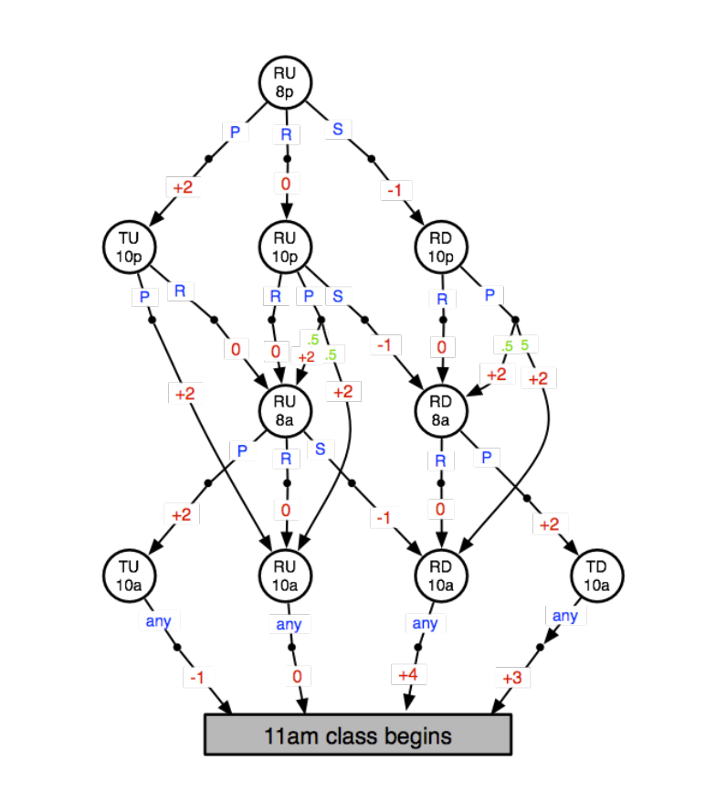

# Markov-Decision-Process CS 4320: Artificial Intelligence 

Objective
======
To expirement with some of the basic algorithms for solving MDPs on a simple domain.

Groups: You may optionally work in groups of 2 students.

Doomain: The domain is based on a simple MDP originally designed by Rich Sutton at the University of Alberta. The example describes a Markov Decision Porcess that models the life of a student and the decisions one must make to both have a good time and remain in good academic standing.

States
======
    R = Rested 
    T = Tired
    D = Homework Done
    U = Homework Undone
    8p = eight o'clock pm

Actions
======
    P = Party
    R = Rest
    S = Study
any means any action has the same effect

*note: not all actions are possible in all states*

Red numbers are rewards 

Green numbers are transition probabilities (all those not labeled are probability 1.0)

The gray rectangle denotes a terminal state.

See below for the diagram of the MDP.

 
